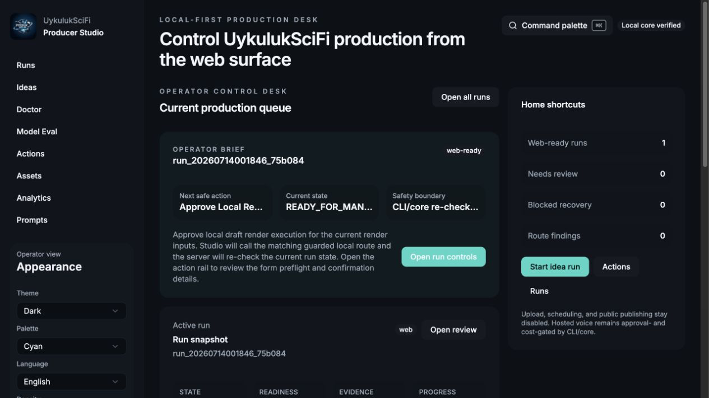
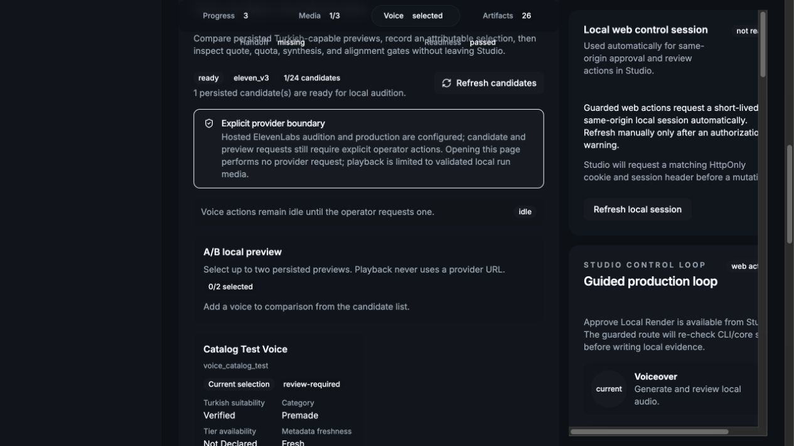

# UykulukSciFi Producer

```text
  _   _       _          _       _     ____       _ _____ _
 | | | |_   _| | ___   _| |_   _| | __/ ___|  ___(_)  ___(_)
 | | | | | | | |/ / | | | | | | | |/ /\___ \ / __| | |_  | |
 | |_| | |_| |   <| |_| | | |_| |   <  ___) | (__| |  _| | |
  \___/ \__, |_|\_\__,_|_|\__,_|_|\_\|____/ \___|_|_|   |_|
        |___/

Studio-first production desk for original Turkish YouTube episodes.
```

[](https://github.com/ogiboy/uykuluk-scifi/actions/workflows/ci.yml)
[](https://sonarcloud.io/summary/new_code?id=ogiboy_uykuluk-scifi)
[](LICENSE)

UykulukSciFi Producer turns an approved idea into a reviewable production package, voice track,
subtitles, visual plan, local FFmpeg render, and final handoff evidence. It is local-first, not
local-only: mock, Ollama, llama.cpp, deterministic voice, Piper, and approved hosted engines sit
behind the same human approvals, budgets, evidence, and readiness gates.

This is not a generic AI video platform, content farm, autonomous agent runtime, or one-click public
publishing bot. Studio is the operator experience; CLI/core remains the source of truth underneath.

## What It Does

- Generates and reviews Turkish ideas, scripts, metadata, scenes, and production packages.
- Preserves prompt, source, model, approval, revision, cost, and artifact provenance.
- Auditions ElevenLabs voices through a bounded catalog and persisted local previews.
- Records attributable voice selection, production-rights confirmation, quote, reservation,
  synthesis, settlement, and recovery evidence.
- Produces aligned Turkish SRT from verified ElevenLabs original character timing.
- Keeps deterministic-local and Piper as credential-free/offline timing and voice fallbacks.
- Builds render plans, contact sheets, local FFmpeg MP4 drafts, chapters, and review bundles.
- Fails closed when approval, budget, config, evidence, or provider outcome is unsafe or uncertain.

## Current Product Status

| Area                             | Status                                                        |
| -------------------------------- | ------------------------------------------------------------- |
| Local mock workflow              | Available without paid credentials                            |
| Studio guarded workflow          | Available; normal operator surface                            |
| ElevenLabs v3 contracts          | Implemented: catalog through recovery and settlement          |
| ElevenLabs live production proof | Pending one approved commercial synthesis smoke               |
| Aligned subtitles                | Implemented and bound into exact render approval              |
| Voice audition in Studio         | Implemented; real Studio browser UAT passed                   |
| Visual production                | Static/manual plus mock-verified FLUX.2 Pro hosted generation |
| Private YouTube upload           | Pending v1 controlled-distribution slice                      |
| Public or scheduled publish      | Unavailable and out of v1                                     |

## Screenshots





## Requirements

- Node.js 22 or newer
- Corepack and the repository-pinned `pnpm@11.9.0`
- FFmpeg and `ffprobe` for rendering
- Optional: Ollama or llama.cpp for local generation
- Optional: Python `uv` and Piper for local Turkish speech
- Optional: ElevenLabs and BFL credentials for explicitly approved hosted media operations

## Five-Minute Setup

```bash
git clone https://github.com/ogiboy/uykuluk-scifi.git
cd uykuluk-scifi
corepack enable
pnpm install
pnpm producer init
pnpm producer doctor
pnpm studio
```

`producer init` creates ignored `producer.config.json`. Keep provider mode `mock` for the first
credential-free run. Copy `.env.example` or `apps/studio/.env.example` only when an optional
integration is needed; blank optional values are safe.

Open the loopback Studio URL printed by Next.js. The Doctor page shows real config, provider, TTS,
FFmpeg, asset, and safe-publishing status before a run begins.

More setup detail: [Getting started](docs/getting-started.md).

## Studio Workflow

```text
doctor -> idea -> approval -> script review -> package -> voice audition
       -> quote/cost approval -> voice/subtitle review -> visual review/regeneration
       -> exact render approval
       -> FFmpeg MP4 -> final review -> manual channel handoff
```

Opening the voice panel performs no provider call. Candidate and preview work begins only from an
operator action, and preview playback uses validated local run media rather than provider URLs. The
visual panel prepares a deterministic 12–24 beat fallback, supports batch decisions and manual
PNG/JPEG revisions, or runs an exact approved FLUX.2 Pro batch with rejected-only regeneration.

Private upload and processing review will extend this journey in a later v1 slice. Public and
scheduled publishing remain inaccessible.

Full operator guide: [Studio workflow](docs/operator-guide/studio-workflow.md).

## Providers

| Provider            | Purpose                                             | Credentials            |
| ------------------- | --------------------------------------------------- | ---------------------- |
| Mock                | Deterministic install and pipeline checks           | None                   |
| Ollama / llama.cpp  | Replaceable local idea and script generation        | None                   |
| Deterministic local | Reference timing and pipeline audio                 | None                   |
| Piper               | Offline Turkish voice fallback                      | None after model setup |
| ElevenLabs v3       | Hosted audition and approval-bound production voice | Server-side key        |
| FLUX.2 Pro          | Hosted scene stills and rejected-only regeneration  | Server-side key        |

Read [local model setup](docs/providers/local-models.md) and [voice](docs/providers/voice.md) or
[visual provider contracts](docs/providers/visuals.md) before changing provider mode.

## Safety Boundaries

- Secrets stay server-side and never enter Git, Studio responses, prompts, artifacts, or logs.
- Paid calls require an exact quote, approval, reservation, operation ID, explicit confirmation,
  bounded execution, settlement, and redacted evidence.
- Studio mutations require same-origin JSON, action identity, local session proof, and core
  revalidation.
- Stale or tampered artifacts, uncertain provider outcomes, and insufficient budgets block progress.
- Upload, deploy, messaging, and publishing effects require separate explicit authority.

See [Security and operating model](docs/security/operating-model.md).

## Documentation

- [Documentation index](docs/README.md)
- [CLI reference](docs/reference/cli.md)
- [Run artifacts](docs/reference/artifacts.md)
- [Provider and artifact troubleshooting](docs/troubleshooting/provider-and-artifacts.md)
- [Architecture](docs/architecture/overview.md)
- [Quality gates and releases](docs/release/quality-gates.md)
- [Roadmap](ROADMAP.md)
- [Production asset inventory](assets/README.md)

Documentation remains versioned Markdown; a docs site is deferred until navigation stabilizes.

## Development

```bash
pnpm test
pnpm check
pnpm qa:product
pnpm qa:browser
pnpm version:plan
```

Use focused tests while developing; at PR readiness run the
[full quality gates](docs/release/quality-gates.md). Paid calls do not run in CI.

## License

GNU Lesser General Public License v3.0. See [LICENSE](LICENSE).
